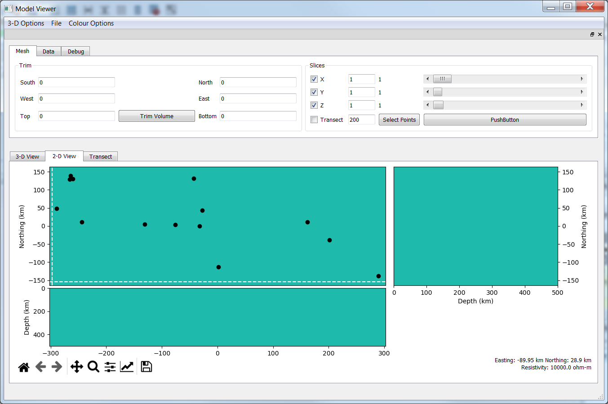
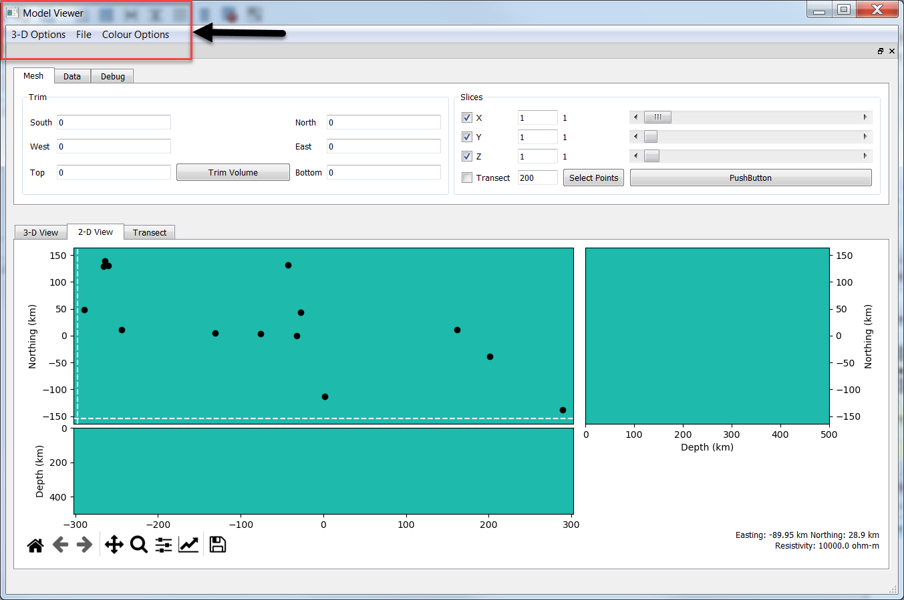
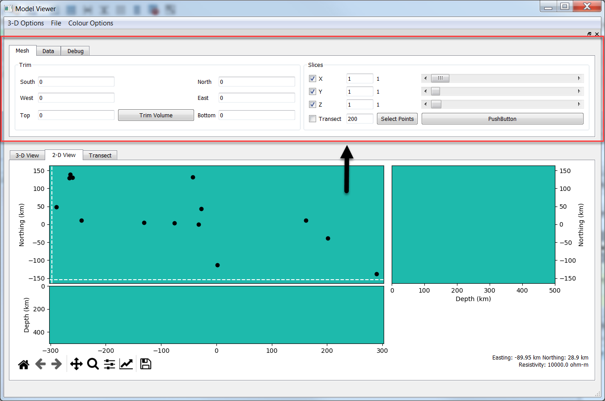
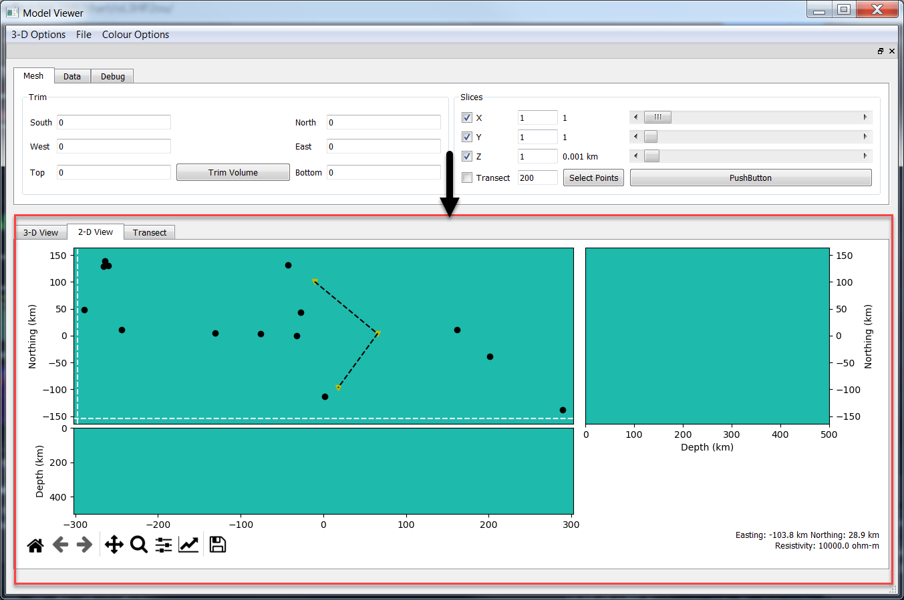

.. _Model Viewer:

Model Viewer - Main Window
==========================

The Model Viewer window is has 3 sections: The `Menu Bar`_, `Control Dock`_, and `Plot Window`_.

This GUI is still under development, so there may be some widgets in the GUI that have not been fully implemented yet.

Menu Bar
--------

	
The Menu bar currently has two sub-menus.

The 3-D Options sub-menu has options for resetting the `3D View`_ to an XY, XZ, and YZ view.

The Colour Options sub-menu has options for changing the colour map, as well as the colour limits of all plots.

Control Dock
------------

The Control Dock contains options for navigating through the model. Only the Mesh tab has been implemented in this release. The Control Dock can be detached from the main window to make more space for the `Plot Window`_.

The Mesh tab has two groupboxes: Trim and Slices

The Trim groupbox is used to adjust the bounds of the model that are plotted. 

By default, the full model is shown. Edit each line beside the South, North, etc., labels to define how many cells to trim from the corresponding directions. Hit the Trim Volume button to perform the operation. This operation will generate new model plots for all of the subplots in the `2D View`_, as well as for the `3D View`_.

The Slices groupbox controls which slices are plotted. The X, Y, and Z checkboxes are used to turn off/on the corresponding slices in within the `3D View`_. The nearby line edits and slider bars are used to control the location of the each plotted slice.

The last line in the Slices groupbox is used to generate a transect slice along a specified set of points. 

* Hit the Select Points button to begin picking. Picking must be performed within the Plan View plot of the `2D View`_ (hitting the Select Points button will automatically switch the tab focus accordingly).
* Click within the Plan View window to assign points through which the slice will go through.
* When all the desired points have been selected, hit the Select Points button again.
* A set of points will appear on the Plan View plot indicating your clicks, and the corresponding transect will be plotted within the `Transect`_ tab, as well as within the `3D View`_.
	* The transect slice within the 3D View can be toggled with the Transect checkbox.

Plot Window
-----------

.. figure:: ../../images/model_viewer_3D_view.png
    :align: center
    :scale: 50 %

The Plot window is where the model is plotted. It has 3 tabs: `3D View`_, `2D View`_ and `Transect`_

3D View
^^^^^^^

The 3D View tab shows the model in a rotatable, zoomable 3D view (similar to in Paraview).

Rotating of the model is done by left-clicking and dragging.

To zoom, either use the scroll wheel or click and hold the right mouse button and drag in or out.

To pan, hold the middle mouse button and drag.
	* Panning also changes the center point of the plot (i.e., the point around which rotations will be focused)
	* To reset to the original center point, hit 'r'

You can quick-zoom to certain angles using the options in the 3-D Options menu of the `Menu Bar`_.

Change which slices are plotting using the controls within the Slices groupbox of the Mesh tab in the `Control Dock`_.

Use the 'W' and 'S' keys to toggle between surface and wireframe representations of the model. The default view is surface. The wireframe represention can be used to see the model mesh.

2D View
^^^^^^^

The 2D View tab shows slices through the model in 2-D. It consists of:

* A Plan View plot, showing slices through the XY plane (top left plot)
* An XZ view, showing depth slices through the XZ plane (top right plot)
* A YZ view, showing depth slices through the YZ plane (bottom left plot)

The toolbar at the bottom can be used as in normal matplotlib figures.

The bottom right of the toolbar shows location and resistivity information when the mouse is hovered over any of the 2-D plots.

* Note: Still troubleshooting this feature a bit. It seems to work for the most part, but occasionally the displayed resistivity value seems to not match the feature seen in the plot.

Transect
^^^^^^^^

Once a transect path is selected using the Select Points button, the corresponding slice through the model will be displayed here.

* This plot does not currently properly update when changing certain plot options.
	* Changes the colour map, colour limits, and Trim are not reflected in this plot.
	* The workaround until this is fixed is to change the plot options first, then reselect the transect plot points with the Select Points button.