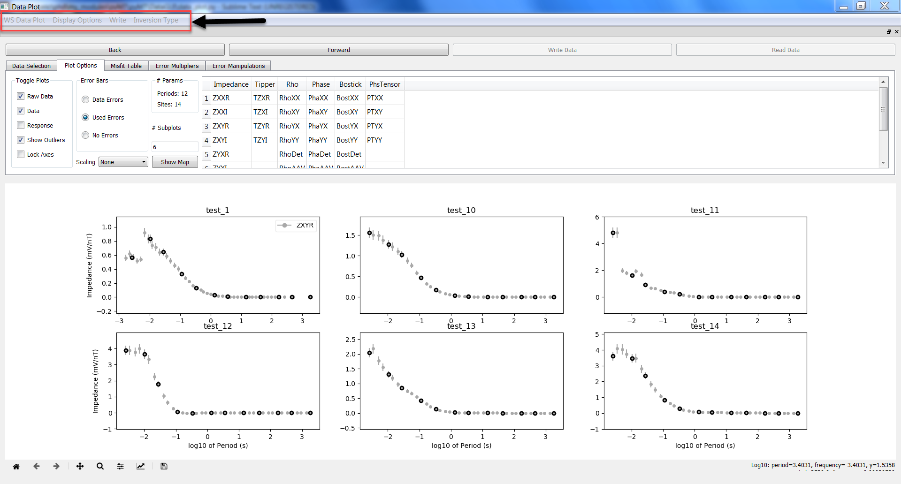

Data Plot - Main Window
=======================

When the Data Plot GUI is launched, you will see a screen that looks something like:

.. figure:: ../../images/data_plot_opening_screen.png
    :align: center
    :scale: 50 %

From here there are 5 main areas. From top to bottom:

* `Menu Bar`_
* `Forward and Back Buttons`_
* `Tabs Window`_
* `Plot Window`_
* `Toolbar`_

The Forward and Back Buttons as well as the Tabs Window are contained within a dock that can removed from the main window and moved to a different location if desired. 

WARNING: Do not exit the docked window (i.e., do not click the 'x' contained in the gray bar of the dock), as there is no way to get it back and the Data Plot GUI will need to be closed and relaunched.

.. _Menu Bar:

Menu Bar
--------

The menu bar offers a number of options from various drop down menus.

The 'WS Data Plot' menu... does nothing. It is a legacy menu that was never used for anything other than testing.

The 'Display Options' menu, as the name implies, gives a few options for changing the display behavior of the main plots.

* Phase Wrap: The default behavior when plotting phase data is to have the XY mode in the 1st quadrant, and the YX mode in the 3rd quadrant. The 'Phase Wrap' button forces both to be plotted into the 1st quadrant.

* Error Bars: The errors from both the raw data and inversion data files are plotted by default (if both are available). When creating data files for inversion, you may want to turn one or the other off. Hovering this menu will drop out options to turn the Raw or Data error bars on or off

* Write: This menu gives various output options.

	* List File: Writes out a new list file corresponding to any changes you've made in the GUI (e.g., order changes, addition or removal of stations)

	* Data File: Writes out a data file in the chosen format corresponding to the selected periods and inversion type

	* Current Plot: Writes out the current plot window to a PDF file. Note that a PNG version can also be saved using the `Toolbar`_, although the resolution may not be as good.

	* All Plots: Iterates through all stations and writes them all to a single PDF file (using the number of subplots indicated in the `Plot Options`_ tab).

		* This has not been fully debugged, and may crash the GUI. Known instances of this are when you attempt to overwrite an open PDF file.

* Inversion Type: Used to control which data components are written to a data file. If nothing is selected, it defaults to all components that were originally read in.
	* Note that some inversion types only work with certain file formats. Inversion types 1-5 work for both WSINV3DMT and ModEM, while inversion types 6-10 only work with ModEM.

.. _Forward and Back Buttons:

Forward and Back Buttons
------------------------

.. figure:: ../../images/forward_back_buttons.png
    :align: center
    :scale: 50 %

These are used to iterate through the stations to be plotted.
There is a known bug here where if more subplots are used than there are stations available, using these buttons will result in one station being re-plotted in the remaining subplots. 

Tabs Window
-----------

.. figure:: ../../images/data_plot_tabs_window.png
    :align: center
    :scale: 50 %

The Tabs Window is the main control window for the Data Plot GUI. There are (currently) 5 tabs, with each giving different options for either the manipulation or plotting of the data.

Data Selection
**************

.. figure:: ../../images/data_plot_selection_tab.png
    :align: center
    :scale: 50 %

The main controls within the Data Selection tab are the 'Add Periods to Data' checkbox, and the 'Site List' / 'Removed Sites' tables.

Adding and Removing Periods
^^^^^^^^^^^^^^^^^^^^^^^^^^^

By default, clicking on the plots within the `Plot Window`_ gives behavior similar to what you would expect from a normal plot window (e.g., you can use the `Toolbar`_ options to pan, zoom, etc.)
To add and remove periods from the inversion, you must first override these controls by checking the 'Add Periods to Data' checkbox. 

Once checked, you can add periods to the inversion by left clicking on a data point that is not already included in the inversion (i.e., a filled, non-outlined circle within a plot). Doing so will add the selected period to the stored data across all sites, and should result in the data point becoming highlighted across all plots.

Periods can be removed from the inversion data by right clicking on an active data point (i.e., one that is outlined in black). This will remove the selected point from the inversion data, resulting in the points outline being removed from all plots.

When you are done selecting periods, uncheck the 'Add Periods to Data' checkbox to resume normal plot behavior.

Note that if a period is selected that is not available at all stations, the data from the closest available period will be used instead at those stations. Be careful when adding periods that are not available at all stations. In extreme cases (e.g., when mixing AMT and broadband data), the closest available period at some sites may be too far from the selected period to be reliably substituted, and essentially becomes dummy data. The error bars on any dummy data must be increased (either within the Data Plot GUI, or programatically), or the data point itself must be manually edited (either programatically or within a data file).

Sorting Sites
^^^^^^^^^^^^^

By default, the order of the stations is the same as the order in which they were read in (i.e., the order in which they appear within a :ref:`List File` or :ref:`Data File`).

The 'Sort Sites' drop down menu can be used to reorder the stations by location. Available options are west-to-east, south-to-north, and 'Clustering'. The 'Clustering' option attempts to sort the stations by proximity to each other, so nearby sites are listed next to each other.

At any time you can restore the original ordering by selecting 'Default'.

Reording the stations results in the order being changed within the 'Site List' table, which gives the order in which the stations will be displayed when iterating using the `Forward and Back Buttons`_

Current Dataset
^^^^^^^^^^^^^^^

The Current Dataset drop-down menu controls which dataset is being displayed. If only one dataset was read in from the used :ref:`Startup File`, then only one option will be available.

Note: This feature has not been extensively tested, and at this point is mainly for comparing different inversion results within the same Data Plot window. A known bug exists where changing between different datasets does not update the `Misfit Table`_.

Print Periods
^^^^^^^^^^^^^

This button will print diagnostic information about the periods contained in the dataset into the Debug Window (the far right window within the Data Selection tab).

The printed periods correspond to those periods that are available at least 50% of the stations.
The first column gives the period values. Negative values indicate frequencies instead (1 / period).
The second column gives log10(period).

The last column gives the fraction of stations at which the period is available.
Stars indicate that the periods in that row are currently included in the inversion data.

Azimuth
^^^^^^^

The azimuth spinbox controls the rotation of the stations (both locations and data coordinate system).
The azimuth is always set to a positive number between 0-359.

Data and station rotations are currently set up for 3-D inversion, in that a positive azimuth results in a clockwise rotation (from north) of the station locations, and a counter-clockwise rotation of the data. As a result, the rotating the data within the Data Plot GUI is not suitable to rotation and projection into 2-D.

This feature has been tested, but not used extensively. Therefore, always double check that the location and data rotations are correct. Inverting incorrectly rotated data leads to incorrect models.

Site List
^^^^^^^^^

The 'Site List' and 'Remove Sites' indicate which sites are currently included in the inversion data, and which have been removed, respectively.

Sites can be removed by selecting them within the Site List and clicking the right arrow (to the right of the list). Sites that have been removed can be added back in by selecting them within the Removed Sites table and clicking the left arrow.

Currently there is no way to add new sites to an existing :ref:`Data File` from within the Data Plot GUI. Such an operation can be done programatically through the API. See the :ref:`Recipes` section for more details.

Diagnostic Windows
^^^^^^^^^^^^^^^^^^

There are 2 additional widgets within the Data Selection tab that are non-interactive and only for display purposes.

The first is the '# Params' box, which simply displays the number of periods and number of sites currently included in the inversion data.

The second is an empty white box that displays diagnostic information. Since the terminal used to launch the Data Plot GUI is inaccessible during operation of the GUI, information will be printed here instead (e.g., information printed out from the `Print Periods`_ button)

.. _Plot Options:

Plot Options
************

.. figure:: ../../images/data_plot_options_tab.png
    :align: center
    :scale: 50 %

The Plot Options tab controls what is plotted within the `Plot Window`_. Additionaly, the :ref:`Map Viewer` is accessed from within this tab.

Toggle Plots
^^^^^^^^^^^^

The Toggle Plots groupbox contains checkboxes for toggling elements to be plotted, as well as some aspects of the plots themselves.

The Raw Data, Data, and Response checkboxes toggle on and off the plotting of their respective components. If a particular data type is not available, the corresponding button *should* be inactive.

The Show Outliers checkbox adds or removes outliers from the `Plot Window`_. This does not remove them from the inversion data or the raw data, but rather trims the axis limits to not include such data within the plots.

It is worth mentioning that the algorithm used to detect outliers is very basic and not particularly robust.

The Lock Axes checkbox is used to force all plots to have the same axis limits. Useful when flipping through the stations to check, e.g., data quality.

Error Bars
^^^^^^^^^^

The Error Bars groupbox controls which error bars are plotted.

When 'Data Errors' is selected, the errors from the original data file are used.

When 'Used Errors' is selected, the errors that will be used in the inversion are shown, i.e., the original data errors multiplied by the error map.

The No Errors button removes all error bars from the plots.

.. _Scaling:

Scaling
^^^^^^^

The Scaling drop-down menu controls how the plotted data is scaled when viewed. 
'None' indicates that the unaltered data is shown.
'Periods' multiplies each data point by its period. Only useful when viewing short and long period data similtaneously.

'Sqrt(Periods)' multiples each data point by the square root of its period. This is the most common option when viewing impedance data, as it allows both short and long period data to be viewed equally well.

The chosen scale factor is only applied to impedance and tipper data, and not for derived data types such as the apparent resistivity and phase.

.. _Subplots:

Subplots
^^^^^^^^^^

The # Subplots edit line controls how many subplots are shown in the `Plot Window`_. The default value is 6. Any positive value works here, however larger values will increase the time it takes to change the plots as the program will have to iterate through more stations to generate each new set of plots.

.. _Show Map:

Show Map
^^^^^^^^

The Show Map button is used to launch the :ref:`Map Viewer`.

.. _Data Component Table:

Data Component Table
^^^^^^^^^^^^^^^^^^^^

The final and largest widget in the Tabs Window is the Data Component Table. This controls which components are plotted into the `Plot Window`_. 

Any number of components can be plotted at the same time by using CTRL+click, SHFT+click, or click+drag provided they are contained in the same column of the table. If components from different columns are selected (e.g., an ZXXR and RhoXY), a pop-up window will appear with a warning and the selected components will be reset.

There is a known bug where the blank items of the table are selectable. However, this results in the first available component being plotted instead, and so should not break the GUI.

.. _Misfit Table:

Misfit Table
************

.. figure:: ../../images/data_plot_misfit_tab.png
    :align: center
    :scale: 50 %

The Misfit Table tab shows information regarding the misfits (calculated as the RMS differences) between the data and response. The tab is separated into two tables. 

The left hand table shows the misfit on a per site basis, with each row representing a single site and each column representing a given data component.

The right hand table gives the misfits on a per period basis, again with each row representing a single period and each column representing a single data component.

Both tables have an additional column for the 'total misfit' across each row. For the left table, this means the total misfit per site (averaged across all components and periods), and in the right table it gives the total misfit per period (averaged across all sites and components). 

The right hand table also contains an additional row at the top that gives the total misfit across all periods and sites for each column. As such, the top left entry of the right table gives the total misfit of the inversion. 

Note, the RMS misfits in this table may differ slightly from what logged by ModEM as pyMT always applies an error floor to any data read in. As ModEM does not explicitly use (or store) an applied error floor, the hard-coded error floors of pyMT may differ from those used in the inversion. As a result, if you used a lower error floor than those coded into pyMT, the misfits shown in this table will be lower.

.. _Error Multipliers:

Error Multipliers
*****************

.. figure:: ../../images/data_plot_multipliers_tab.png
    :align: center
    :scale: 50 %

The Error Multipliers tab is the main control window for setting the data errors. In order to compatible with both WSINV3DMT and ModEM, the error control takes form of integer multiples.
The multipliers shown in a Tree Widget. Site names are given in the left-most column with a small arrow beside them. Clicking on the arrow will collapse or expand the error multiplier tree for that site.
Changing the errors is done by double clicking on the multiplier value for the desired site, period, and component and changing it to the desired value. Assuming you edit the multiplier for a site and component that is currently being plotted, the new errors should be displayed immediately after the edit is completed.

As manually editing many sites, periods, and components is *incredibly* tedious, a few keyboard shortcuts have been made available.

* Holding SHFT while double clicking to edit a multiplier will result in all periods for the chosen site and component being changed.

* Holding CTRL while double clicking will edit the multiplier for all components for the chosen site and period

* Holding ALT while double clicking will edit the multiplier for all sites for the chosen component and period

The keyboard shortcuts may be used in conjunction with one another as well. For instance, holding SHFT+CTRL while double clicking to edit will change the multipliers for all periods and all components across a single station.

Note, double clicking to edit a multiplier and then entering the same value will result in no changes being made, regardless of any keyboard shortcuts being used.

Default behavior of the Error Multiplier tree widget is to have the stations automatically expand and scroll to the sites currently displayed in the `Plot Window`_.

The Error Multiplier tree currently only accepts integer values. However, negative values may be used to decrease the applied errors.
For example, setting a multiplier to 5 increases the error by, and subsequently setting the multiplier to -2 would divide the error by 2, resulting in a total error of 2.5 times the original error.

Entering a negative value does however result in the multiplier value being reset to 1, in order to ensure consistent use between ModEM and WSINV3DMT data formats.

.. _Error Manipulations:

Error Manipulations
*******************

.. figure:: ../../images/data_plot_manipulations_tab.png
    :align: center
    :scale: 50 %

The Error Manipulations tab allows for more broad-stroke error setting compared.
Within the Group Manipulations box are 3 buttons.
The 'Refresh' button is a debug button. All it does is force the `Error Multipliers`_ tree to reset. This button should not be needed, but does nothing to the data itself.

The 'Regulate Errors' button automatically sets errors for the entire dataset in the following manner.
A smoothed version of the raw data is calculated using a smoothing filter.

The filter length is given by the value in the 'Filter Length' spinbox. The higher the value, the more smoothing is applied (values between 0.7 and 1.2 have are generally good).

The distance between the data points and the smooth curve is then calculated, and multiplied by the value in the 'Multiplier' spinbox. This value is then set as the error. 

The result of this process is that data that is already nearly smoothly varying have relatively low errors, while outliers jittery data will have higher error.

The 'Reset Errors' button simply resets all errors to the error floor. Floor values are given for each set of components in the table to the right of the 'Group Manipulations' groupbox.

.. _Plot Window:

Plot Window
-----------

.. figure:: ../../images/data_plot_figure_window.png
    :align: center
    :scale: 50 %

The Plot Window contains all the plots of the data.
Nearly all plotting options can be found either within the `Plot Options`_ tab, or the `Menu Bar`_.
The currently displayed data components will be given in a legend within the 1st (top left corner) plot.

Toolbar
-------

The Toolbar is the basic Matplotlib toolbar. It contains buttons which may be activated to interact with the plots within the `Plot Window`_.

It contains, from left to right:

* Home: Resets the views for all plots
* Back: Returns to the previous view
* Forward: Goes to the next stored view
* Zoom: Activates a zoom cursor. Drawing a rectangle in any subplot will zoom to that locations within that plot
* Subplot Options: Offers options for customizing the margins and general layout of the subplots. The most useful option here is the 'tight layout' button, which will force the subplots to fill the Plot Window
* Axis Options: Contains options for customizing individual axes
* Save: Save the current Plot Window to a PNG file.

In addition to the Toolbar buttons, hovering over any of the plots will show the x-y coordinates of the cursor in terms of the frequency and period.